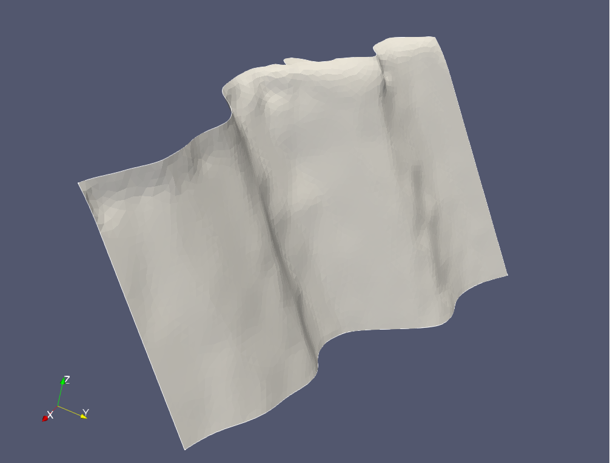

# Examples of Meshed CFM v5.2 Faults

This repository contains examples of geometric models constructed for some of
the faults in the [CFM](https://www.scec.org/research/cfm). The geometric models
are constructed using the package
[splinefit](https://github.com/ooreilly/splinefit) and can be imported into most
CAD software programs and mesh generators such as [gmsh](https://gmsh.info)
(free and open source). 

*The Santa Susana fault, geometric model generated using splinefit, meshed using
gmsh at 500 m resolution, and rendered in Paraview.*

## Getting started
Please follow these [instructions](start.md) to make sure that your environment
is properly configured.

## Tutorials
To begin learning how to use the
[splinefit](https://github.com/ooreilly/splinefit) package and external tools,
see the the following tutorials. These tutorials demonstrate give step by step
instructions by targeting three different fault zones in the CFM. 

1. [San Clemente Fault Zone](san_clemente/) - an introductory tutorial that covers
   basic usage.
2. [Ludlow-Cleghorn Lake Fault Zone](ludlow_cleghorn/) - learn how to
   crop a model so that it does not extend above sea level.
3. [Sierra Madre Fault Zone](sierra_madre/) - learn how to respect intersecting.
   faults and generate conforming meshes.

## Examples

* [Santa Susana Fault](santa_susana/)
* [San Bernardino Fault Zone](san_bernardino/)
* [Harper Fault Zone](harper/)
* [Garlock Fault Zone](garlock/)
* [Garnet Hill Fault](garnet_hill/) (*NOT YET WORKING*)

## Contributions Welcome

Please contribute to this repository by meshing a fault zone in the
[CFM](https://www.scec.org/research/cfm) and by sharing your configuration files in
a pull request. We recommend that you follow the style of presentation used for
the [Examples](#examples). In more detail, create a directory labeled after the fault zone
and include the files:
* `download.sh` - script that downloads 500 m resolution regularized CFM meshes
  for the particular fault zone.
* `config.sh` - script that configures [splinefit](https://github.com/ooreilly/splinefit)
* `README.md` - provides a description of the fault zone and meshes, and figures showing
  the final result. The readme file may also include any additional instructions
  necessary to reproduce the final result.
* `figures/*` - a subdirectory that contains figures showing the generated
  surfaces and mesh. This directory should ideally include figures showing the
  original mesh so that it easier to judge if the new geometry is a good
  approximation of the original geometry. 

