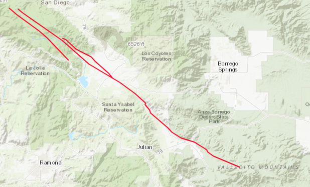
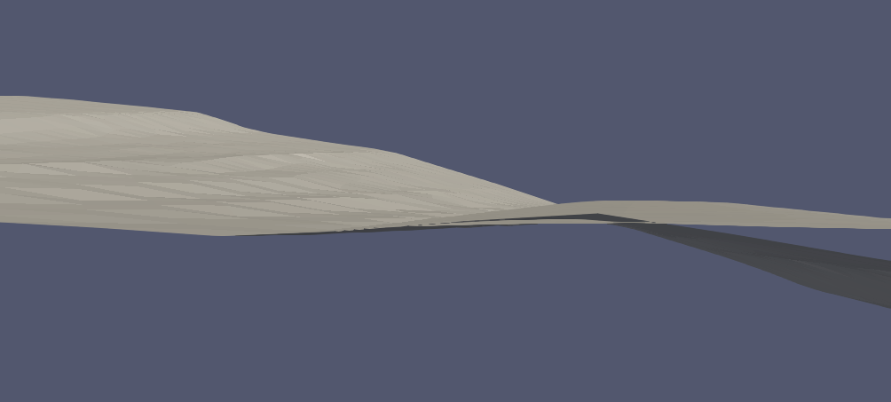
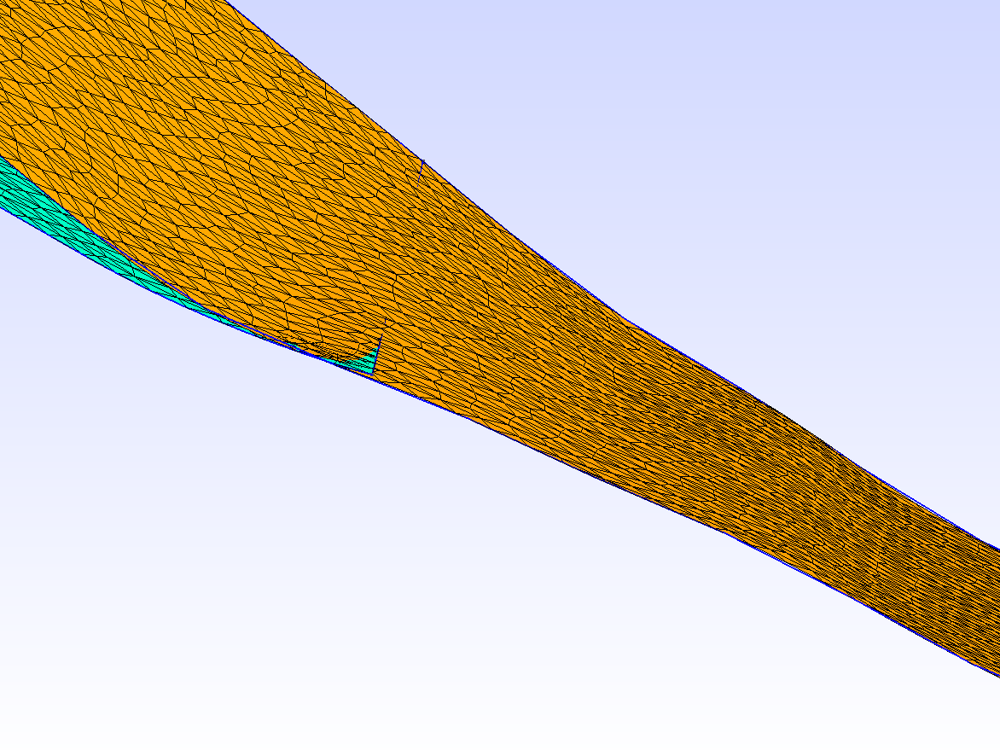

# Agua Tibia Earthquake Valley Fault Zone (Not yet working)

*Map view of the Agua Tibia Earthquake Valley fault zone*

In the CFM, the main fault and branch are not properly connected. As can be seen
in the figure below, the branch intersects the main fault (top feature). This type of
intersection makes it difficult for the computational geometry engine to join
the branch to the main fault.

Here is the same problem illustrated in gmsh:

