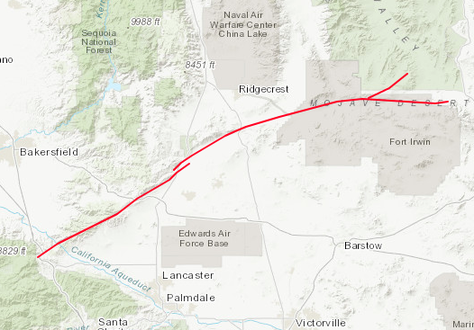
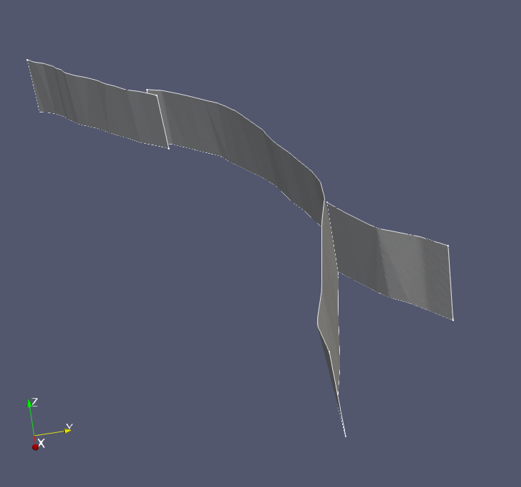
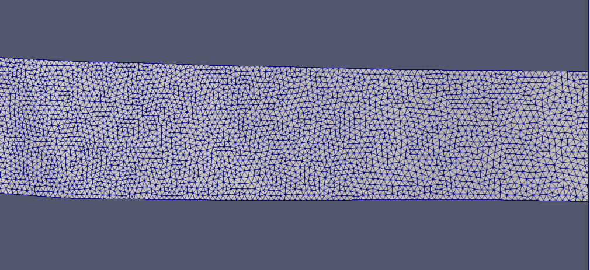
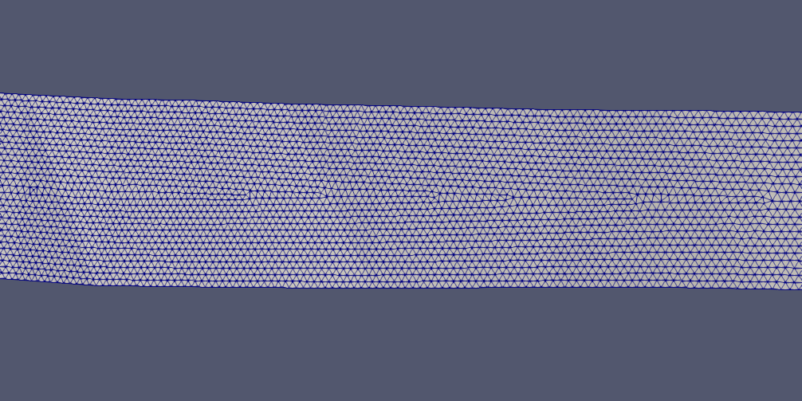

# Garlock Fault Zone

*Map view of the Garlock fault zone*

*Geometrical model generated for the Garlock fault zone, rendered in Paraview*

The Fault segments are not joined together since it is unclear if there is any
intersection.

*Close-up of the mesh, generated using gmsh, 500 m resolution*

*Close-up of the mesh, regularized 500 m  CFM mesh*

