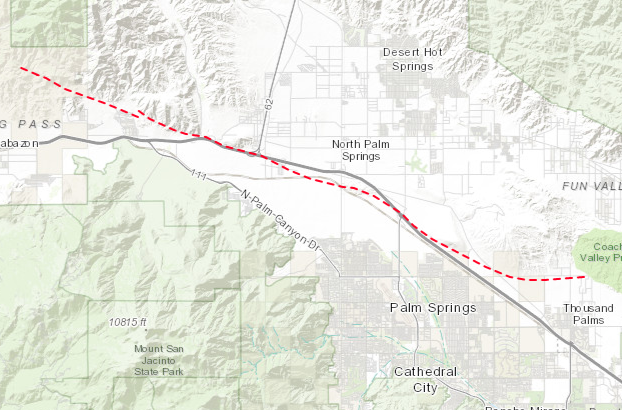

# Garnet Hill Fault

**NOT YET WORKING**

*Map view of the Garnet hill fault.*

The BSpline fitting tool produces a poor fit for the main fault. The reason
why this happens is because the point cloud data for the main fault also
contains point cloud data for the branch. As a result, the fitting tool tries to
honor both datasets using a single surface.

*Fitting of surface (blue) to point cloud data for the main fault (black).*

*Side view showing that the fitted surface tries to honor point cloud data on
two different surfaces*

*Fitting of surface (blue) to point cloud data for the branch (black). The main
fault point cloud data is not present in this data set. Therefore, there are
no artifacts.*

## Modified mesh

The following figure was constructed using a modified mesh. The modified mesh
consists of several surfaces that are joined together, producing a conforming
mesh. These surfaces are visible in the figure. Each surface is shown in a
different color. A problem with this approach is that the presence of thin geometric features can result in
a low quality mesh. You can see this problem in the upper section of the fault.
For this reason, it is recommended that you try to join small surfaces prior to
fitting. In this particular case, it should had been sufficient to have two surfaces: one surface for the main fault, and one surface for the branch.

