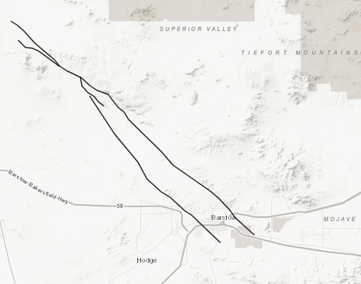
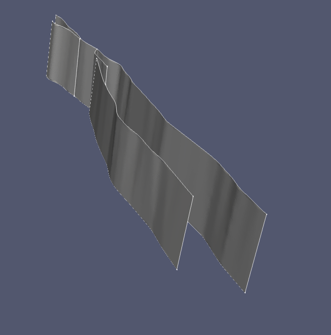
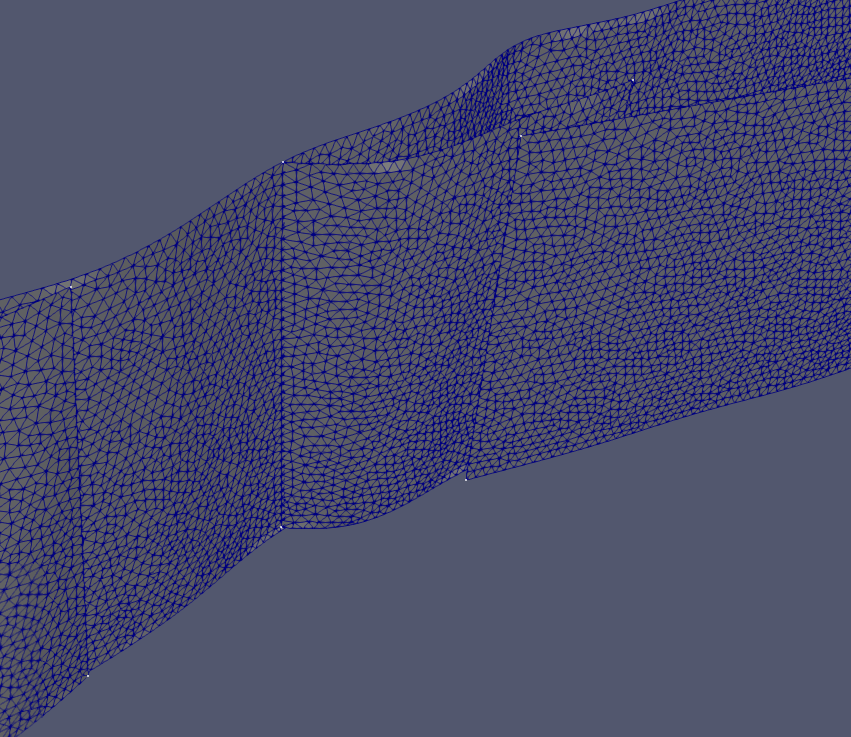

# Harper Fault Zone

*Map of the Harper fault zone*

*Geometrical model generated for the Harper fault zone meshed in gmsh using 250
m resolution and rendered in Paraview*

*Close-up of the mesh, which is conforming at the junction point*

