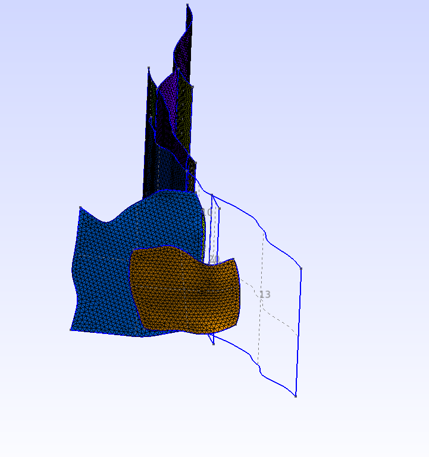

# Landers Fault (not yet working)

*Map view of the Landers fault*

There are two problems encountered for this fault. 
1. The BSpline fitting tool fails when processing surface 6.
2. The mesh generator gmsh fails to mesh some of the surfaces.

In the figure below, you can see that surface 13 (and other surfaces) have not
been meshed.

It is unclear what causes the problem, but it is probably due to having some
surface intersection that leaves gaps or protrusions.

