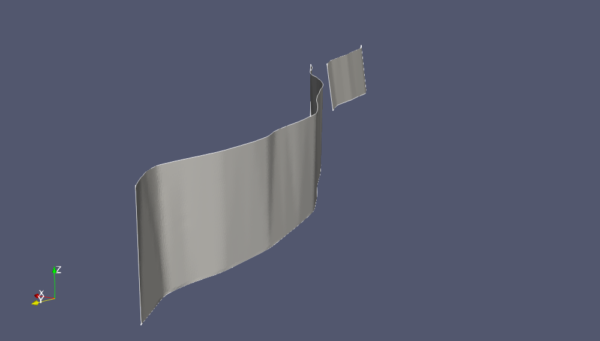
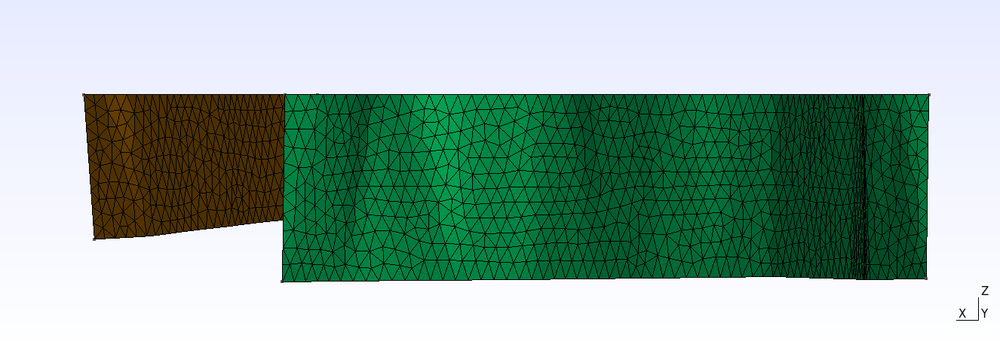
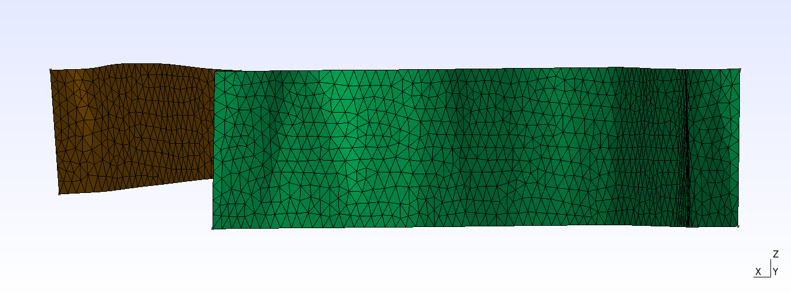
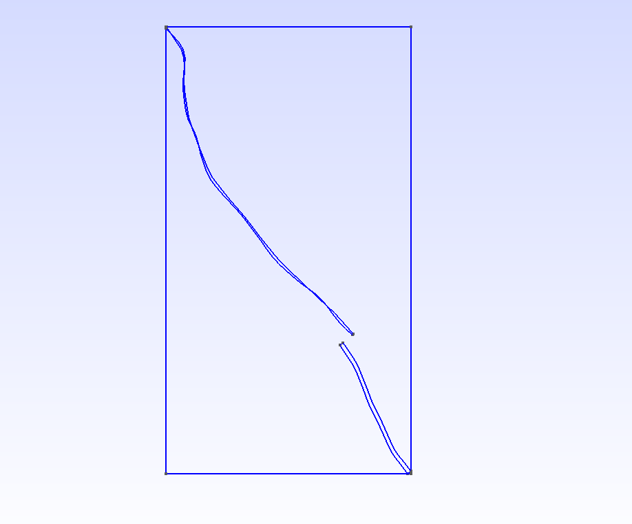
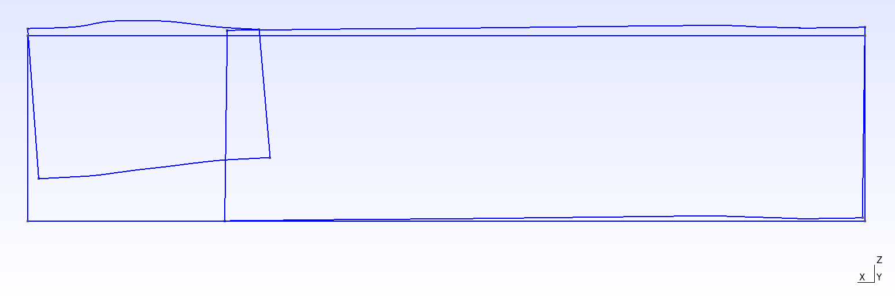

# Tutorial 2 - Ludlow-Cleghorn Lake Fault Zone

In this second part of the tutorial you will discover how to crop meshes at the
sea-level. If this capability is not of interest to you, you can skip this
tutorial and move onto the next one.


*The Ludlow-Cleghorn Lake Fault Zone cropped at sea level and rendered in Paraview.*

## Overview

This tutorial builds upon the previous one. By now, you should be somewhat
familiar with obtaining CFM meshes, producing CAD geometries, and meshing them
using gmsh. 

We begin by obtaining the final result,
```bash
$ make download build crop mesh project=ludlow_cleghorn_cropped
```
We set the `project` variable to `ludlow_cleghorn_cropped` so that the final
mesh will be saved under a different name than the default one. Load
`ludlow_cleghorn_croppped_1000m.msh` into gmsh to obtain



As can be seen by the completely horizontal profile, the mesh has been cropped at
sea level, `z = 0`.  

In comparison, you can obtain a mesh without any cropping at sea level by
calling

```bash
$ make geo mesh
```
The generated mesh is the file `ludlow_cleghorn_1000m.msh` and when this file is
loaded into gmsh you should see



## Geometry cropping

The two faults are cropped at sea level by drawing a
bounding box around them. This bounding box only extends up to the sea level, but otherwise encapsulates the fault surfaces. 
Anything outside the bounding box is removed.

While it is entirely possible to manually go in draw a bounding box, we can use
the tool `sfbbox` to compute it for us. This tool reads in each tsurf file that
we wish to compute a bounding box for. Since the tsurf files can be found in the
directory `meshes`, we can simply do:
```bash
$ sfbbox meshes/*.ts > bbox.txt

```
The output is:
```bash
$ cat bbox.txt
602787 3.7827e+06 -8187.5 13834.1 25471.3 9040.5
568839 3.80974e+06 -10600.5 36536.8 60054.6 11206
```
Each row is the bounding box of a surface in the tsurf file. If the tsurf file
contains multiple surfaces, then one bounding box per row will be displayed. The
first three columns denote the (x, y, z) coordinates of the minimum corner of the bounding box. By
convention, this corner is typically the bottom left corner of the front side of
the bounding box. The remaining three columns give the scale of the bounding box
in the x, y, and z-directions, respectively. 

All that remains is to construct a new bounding box that is the contains all of
the bounding boxes in `bbox.txt` but that does not extend beyond z > 0.
The tool `sfgeo` can automatically determine this box for us. We have
encountered this tool before. When constructing a gmsh script. As before, we
need to provide the fault geometries we wish to load. Since we currently do not
have this file present, we can create it by calling
```bash
$ make faults
```
Then do:
```bash
$ sfgeo faults.txt bbox.txt > ludlow_cleghorn_cropped.geo
```
will contain all that is needed for gmsh to crop the two fault geometries.
Before we let gmsh crop the geometries, you may want to inspect the bounding
box. Open the script `ludlow_cleghorn_cropped.geo` and comment out the last line
 by placing `//`. It is this line that performs the cropping operation by
 computing the intersection between the two surfaces and the volume of the
 bounding box.

```bash
a1() = ShapeFromFile("MJVA-LCLZ-LDLW-Ludlow_fault-CFM5_m500/iges/surface_0.igs");
a2() = ShapeFromFile("MJVA-LCLZ-CLGL-Cleghorn_Lake_fault-CFM5_m500/iges/surface_0.igs");
Box(1) = {568839, 3.7827e+06, -10600.5, 47782.1, 87094.6, 10600.5};
// BooleanIntersection{ Surface{1}; Surface{2}; Delete; }{ Volume{1}; Delete; }
```
Load the script `ludlow_cleghorn_cropped.geo` into gmsh to inspect the bounding
box




As we can see in the figures above, the bounding box encapsulates the faults but
does not extend beyond z > 0. Since the bounding box looks good, you can go
ahead and remove the comment and reload the script. After reloading and meshing,
the resulting mesh produced should be similar to the one presented in the
beginning of this tutorial. 

The explanations found in this section have been scripted together and wrapped
up using the command `make crop project=ludlow_cleghorn_cropped`. 


When you feel that you are done with this tutorial, you can clear your workspace
by calling
```bash
make clean
```
This command will restore the project directory to its original state.


