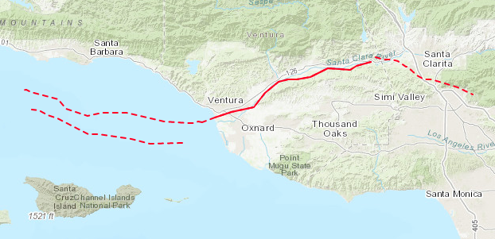
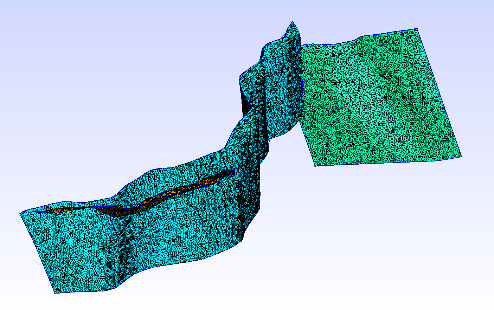
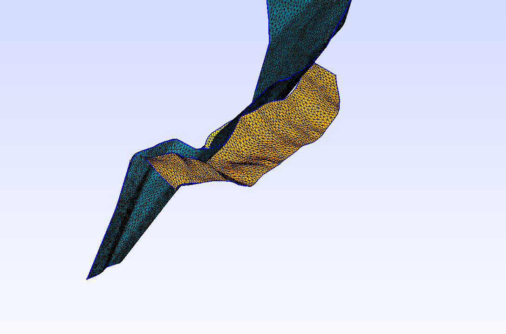
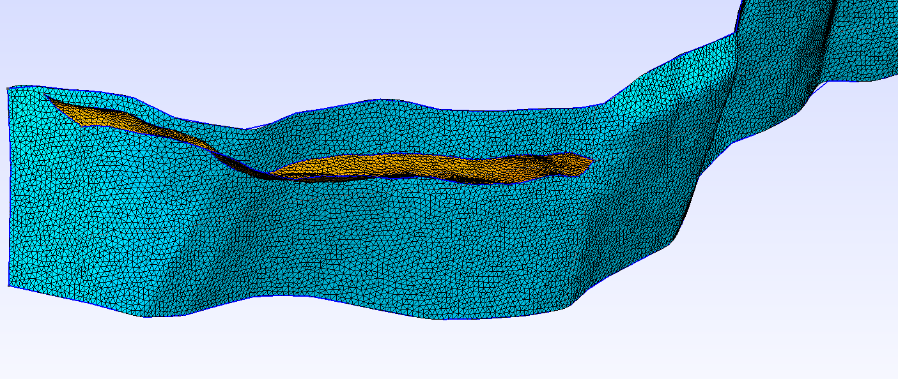
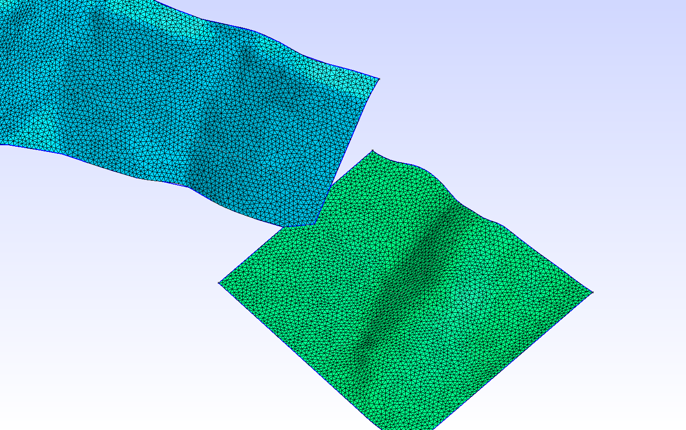

# Oak Ridge Fault Zone

*Map view of the Oak Ridge Fault Zone.*

In the Oak Ridge fault zone the Mid Channel Fault intersects the Oak Ridge
fault, leaving gaps and protruding surfaces. Since the gaps and protruding
surfaces are large, there is no problem for the geometric engine to identify
these intersections. The resulting mesh is conforming. Here shown at 500 m
resolution in gmsh for various angles.

