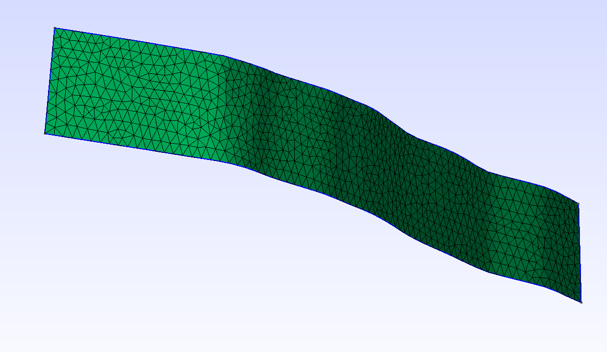

# Tutorial 1 - The San Clemente Fault Zone

Welcome to this first part in a tutorial series that will teach you how to
produce, new mesh high quality meshes for many of the fault systems in the
community fault model. Throughout this series you will learn how to mesh single
faults at any resolution you desire, perform boolean operations to for example
remove parts of faults that extend above sea level, and also generate conforming
meshes for intersecting faults.

In this first part we will explore some basic usage of the tools that spline
fit package provides. In the begin, we will just scratch the surface, but as you
progress further and further, the complexity will gradually increase. The
tutorial is designed to make you familiar with not only using the tools in this
package, but also using third-party tools such as bash scripting, Makefiles,
Paraview, and gmsh. 

## Overview
The first thing we will do is to run a script that will produce the final
result. This script will probably take a while to run, and while it runs, please
feel free to continue reading this tutorial. In your terminal, go to the
directory `san-clemente` and type
```bash
make download build geo mesh
```
If all goes well, these commands will produce several directories and files.
In particular, it will produce a file called `san_clemente_500m.msh`. This file
contains a meshed version of the San Clemente fault zone found in the Community
Fault model, version 5.2. This mesh is meshed at a resolution of about 500 m. To
open the mesh, you need to have [gmsh](https://gmsh.info) installed. Type:
```bash
gmsh san_clemente_500m.msh
```
This is what you will see (click image to enlarge):


To obtain a similar view, you need to know how to navigate the 3D perspective view in gmsh.
If you click the left mouse button and drag you can rotate the camera in gmsh.
Similarly, use the right mouse and button and drag to move the camera up/down,
or sideways. `ctrl + right click` restores the view. To zoom, use `shift + left
drag`. It is also possible to zoom by drawing a box using `ctrl + left drag`.

## Comparing the generated mesh against the original mesh
It is unclear if the geometry of the mesh produced a similar to the geometry of
the original mesh. At no point should you ever trust that the output produced by
this tool is reliable. Please always check the output by comparing it to the
original mesh.

While it is possible to compare the new and original mesh in gmsh, we will use
Paraview instead. The reason being that it is slightly easier to compare meshes
in this program compared to gmsh. To read the generated mesh into Paraview, go
to `file -> export` in gmsh. Choose the desired location and type
`san_clemente.vtk`. The vtk file format is the default file format used by
Paraview. In Paraview, go to `file -> open` and open the file
`san_clemente.vtk`. In the pipeline browser, click `Apply` , as shown below


After clicking apply, the mesh should be visible in the Paraview view port


To make the geometry stand out a bit more, you can change its color by clicking
on `Edit` in the `Properties` panel, 


In the project directory, the following four directories should have been created
```
OCBA-SCFZ-CTLB-San_Clemente_fault_splay-CFM5_m500/     
OCBA-SCFZ-SBRI-San_Clemente_fault_nw_strand-CFM5_m500/ 
OCBA-SCFZ-SCBR-San_Clemente_fault-LEGG-CFM5_m500/      
OCBA-SCFZ-SCLI-San_Clemente_fault-LEGG-CFM5_m500/      
```
Each of these directories is tied to one of the four fault surfaces shown in the
final mesh. The subdirectories `vtk` contain the file `surface_0.vtk`. This file
contains the original CFM mesh data but saved in format that can be read into
paraview. The reason why the file contains `_0` is because there can be multiple
surfaces in a CFM mesh file. Each such surface found is saved as a separate
file. In this case, there is only surface per CFM mesh file. 

To perform the comparison, load each `surface_0.vtk` file into Paraview. Do not
forget to click `Apply`. 


The green surfaces show the new mesh, and the gray surfaces show the original
mesh. Since the green surface mesh is a curved mesh, it does not exactly follow
the original mesh. Nonetheless, it is pretty close to it. 

You can inspect the meshes further by navigating in Paraview. Use `left mouse
drag` to rotate the camera, and `right mouse drag` to zoom in and out. Pressing
the scroll wheel and dragging the mouse lets you move up/down and sideways.

In the pipeline browser, click the eye to show or hide a particular surface. It
is unfortunate that all of the original meshes share the same name. To see the
name of each individual surface, you can click on the tab `Information` next to
`Properties`. The path label should tell you the original fault name.

To show the mesh edges, choose `Surface with Edges` under `Represenation` in the
`Properties` panel. Here is a section of the original mesh:

and here is the new mesh:


## Obtaining CFM meshes
Until now, we have only explored the final mesh and inspected it to assess that
it is an accurate representation of the original geometry. You may have also
learned a few basic commands for interacting with gmsh and Paraview, assuming
you are new to these tools. You will learn more about these tools later.

Now, it is time to learn how we got to the final mesh presented in the previous
section. This time, we will start completely from scratch. You can reset your
project directory by calling
```
make clean
```

The CFM meshes can be obtained through the [CFM
Website](https://www.scec.org/research/cfm). In this tutorial, we use version
5.2 of the CFM and 500 m resolution regularized meshes. Even though your project
may require coarser meshes, it is important to use the highest resolution
available as these will produce a higher quality fit. Please always use the
regularized meshes and avoid trying to use the native meshes. The regularized
meshes have good aspect ratio triangles, whereas the native meshes have
extremely poor aspect ratio triangles. These native meshes do currently not
produce good fits when using the tools in this package.

To obtain meshes, you can also use the 
[CFM Viewer
(Beta)](https://www.scec.org/research/cfm-viewer/)
and select the faults you
want to work with. 

For this tutorial, select the San Clemente fault zone faults and download the
regularized meshes at 500 m. In the CFM, these files are called
```
OCBA-SCFZ-CTLB-San_Clemente_fault_splay-CFM5_m500.ts
OCBA-SCFZ-SBRI-San_Clemente_fault_nw_strand-CFM5_m500.ts
OCBA-SCFZ-SCBR-San_Clemente_fault-LEGG-CFM5_m500.ts
OCBA-SCFZ-SCLI-San_Clemente_fault-LEGG-CFM5_m500.ts
```
Here, their fault traces are shown selected in the 
[CFM Viewer
(Beta)](https://www.scec.org/research/cfm-viewer/):


For the purpose of automation and reproducibility, when you ran the make
command in the beginning of the tutorial, these meshes were automatically
downloaded from the CFM server. The script `download.sh` downloads these files
, and places them in the directory `meshes/` (this directory is created when
calling the script). Please feel free to use this script for your own projects
and modify it to download other fault geometries. This script is wrapped by
calling `make download`

If you manually obtained the CFM meshes, create and place them in the directory `meshes`.
You should now have
```
meshes/OCBA-SCFZ-CTLB-San_Clemente_fault_splay-CFM5_m500.ts
meshes/OCBA-SCFZ-SBRI-San_Clemente_fault_nw_strand-CFM5_m500.ts
meshes/OCBA-SCFZ-SCBR-San_Clemente_fault-LEGG-CFM5_m500.ts
meshes/OCBA-SCFZ-SCLI-San_Clemente_fault-LEGG-CFM5_m500.ts
```

## Generating CAD geometries 
Our next step is to convert each of the San Clemente fault zone meshes into a
CAD geometry file. This process is a series of steps that operates on one mesh
file at a time. The input is a CFM mesh file stored in the
[GOCAD](https://www.scec.org/research/cfm) file format (.tsurf) and the output
is an [IGES](https://en.wikipedia.org/wiki/IGES) file (.igs).  This process is
orchestrated by the command line tool `sfbuild`. It takes two arguments, first a
configuration file that controls many of the configurations options, followed by
the mesh name without extension. In this case, the configuration file is the
bash script `config.sh` and it is provided for you.  For example, call
```
sfbuild config.sh OCBA-SCFZ-CTLB-San_Clemente_fault_splay-CFM5_m500
```
The expected output is similar to:
```bash
Building: OCBA-SCFZ-CTLB-San_Clemente_fault_splay-CFM5_m500
OCBA-SCFZ-CTLB-San_Clemente_fault_splay-CFM5_m500
Converting from GOCAD to gmsh
 - Found 1 surface(s)
 - Wrote <6154 tris, 3245 nodes> : OCBA-SCFZ-CTLB-San_Clemente_fault_splay-CFM5_m500/meshes/surface_0.msh 
Converting gmsh to vtk
Wrote: OCBA-SCFZ-CTLB-San_Clemente_fault_splay-CFM5_m500/vtk/surface_0.vtk
Extracting boundary segments
 - Total number of edges: 9398
 - Total number of boundary edges: 334
 - Number of boundary loops: 1
 - Loop ID: 1, Number of boundary edges: 334 Circumference: 94860.5 
 - Wrote:  OCBA-SCFZ-CTLB-San_Clemente_fault_splay-CFM5_m500/pydata/boundary_0.p
Projecting boundary onto best fitting plane
 - Wrote:  OCBA-SCFZ-CTLB-San_Clemente_fault_splay-CFM5_m500/pydata/projection_0.p
Rotating projected boundary by minimizing its bounding box
 - Wrote:  OCBA-SCFZ-CTLB-San_Clemente_fault_splay-CFM5_m500/pydata/rotation_0.p
Segmenting boundary
 - Wrote:  OCBA-SCFZ-CTLB-San_Clemente_fault_splay-CFM5_m500/pydata/segmentation_0.p
Fitting BSpline curve to boundary segments
 - Processing curve 1: degree = 2 knots = 147 
     Residual: 271.397 
 - Processing curve 2: degree = 2 knots = 19 
     Residual: 153.068 
 - Processing curve 3: degree = 2 knots = 148 
     Residual: 376.101 
 - Processing curve 4: degree = 2 knots = 20 
     Residual: 145.917 
 - Wrote: OCBA-SCFZ-CTLB-San_Clemente_fault_splay-CFM5_m500/pydata/boundary_fit_0.p
Fitting BSpline surface
 - Bounding box dimensions: 86989 x 13005
 - Average distance between points: 342.65
 - Scaled distance between points: 685.3
 - Grid dimensions: 128 x 20
 - Wrote: OCBA-SCFZ-CTLB-San_Clemente_fault_splay-CFM5_m500/pydata/surface_fit_0.p
Exporting BSpline Surface to IGES
 - Wrote: surface_0.igs
Done.
```
The output from build `sfbuild` reveals the step-by-step process discussed
previously.
1. The GOCAD file is converted to gmsh
2. The boundary is extracted
3. The boundary is projected
4. The projected boundary is rotated
5. The rotated and projected boundary is segmented into four pieces
6. Each boundary segment is fitted using a BSpline curve
7. The surface data is fitted using BSpline surface
8. The geometry is exported to IGES

Each of these steps is performed by a separate command line utility, or tool.
These tools are
called:
```
tsurfmsh, sfbnd, sfproj, sfrot, sfseg, sffbnd, sffsrf, and sfiges
```
The tool `sfbuild` wraps and bundles all these tools together so you don't have
to call them individually one by one. If you want to learn more about what a
particular tool does, you can access its help menu on the command line. For
example,
```
sfbnd -help
```

The source code for all of these tools can be found in `bin/` of the main
package. By modifying `sfbuild` can for example introduce additional tools into
the processing chain.

The call to sfbuild shown before is also wrapped in the `Makefile` by calling
```bash
make catalina
```
The make command has been labelled `catalina` because this particular fault lies
in the Catalina basin.

After running `sfbuild` successfully, you should also note that the directory
`OCBA-SCFZ-CTLB-San_Clemente_fault_splay-CFM5_m500` has been created for you.

The structure of this directory is:
* `figures/` figures produced by the tools (`sfbnd`, ...)
* `iges/`  CAD geometries, one per surface
* `meshes/` Original CFM mesh converted to the gmsh file format, one per surface
* `pydata/` Intermediate data 
* `vtk/` Original CFM mesh converted to the vtk legacy file format, one per
  surface

Recall that the CFM meshes can contain multiple surfaces in the same file. In
this case, there is only one surface per file. 

Please repeat the process of calling `sfbuild` for each of the three remaining
faults.

## Meshing

After having successfully generated the CAD geometry file `surface_0.igs` for
each fault, you are now ready to mesh them using gmsh. We will start by opening just
the Catalina fault in gmsh.
```
gmsh OCBA-SCFZ-CTLB-San_Clemente_fault_splay-CFM5_m500/iges/surface_0.igs
```
Once the file has opened in gmsh, press `2` on the keyboard to mesh it. The
default settings for gmsh produces a rather coarse mesh. 


Reload the file by pressing `0` on the keyboard. To increase the resolution, go
to `Tools -> Options -> Mesh -> General`.


Set `Min/Max` element size to for example `1000` for Max size. This size will
correspond to a maximum element size of `1000` m. Feel free to change any other
settings you want. Usually, higher quality meshes are obtained by
`Frontal-Delaunay` algorithm, or `MeshAdapt` algorithm. Here is an example
generated using the `MeshAdapt` algorithm and a maximum element size of `1000`
m.




Reload the file by pressing `0`. 

We can add the other faults as well by choosing `File -> Merge...`. Here is what
the scene looks like after importing the other faults and meshing.


Unfortunately, pressing `0` will now reload the original file and therefore
clear the merged faults. Also, to avoid the trouble of manually having to import
faults one by one, we can put together a small script.

Create a text file called `faults.txt` that contains the path to each of the
four IGES files:

```
OCBA-SCFZ-SCLI-San_Clemente_fault-LEGG-CFM5_m500/surface_0.igs
OCBA-SCFZ-SCBR-San_Clemente_fault-LEGG-CFM5_m500/surface_0.igs
OCBA-SCFZ-SBRI-San_Clemente_fault_nw_strand-CFM5_m500/surface_0.igs
OCBA-SCFZ-CTLB-San_Clemente_fault_splay-CFM5_m500/surface_0.igs

```
This file can also be generated by calling `make faults`. By passing
`faults.txt` as input to the tool `sfgeo` we will a script that can be imported
into gmsh that includes all of the four faults in the same scene.
```
sfgeo faults.txt > san_clemente.geo 

```
This command is also wrapped in the Makefile: `make geo`.

Once the script `san_clemente.geo` has been created, its contents should be
```
SetFactory("OpenCASCADE");
a1() = ShapeFromFile("OCBA-SCFZ-SCLI-San_Clemente_fault-LEGG-CFM5_m500/surface_0.igs");
a2() = ShapeFromFile("OCBA-SCFZ-SCBR-San_Clemente_fault-LEGG-CFM5_m500/surface_0.igs");
a3() = ShapeFromFile("OCBA-SCFZ-SBRI-San_Clemente_fault_nw_strand-CFM5_m500/surface_0.igs");
a4() = ShapeFromFile("OCBA-SCFZ-CTLB-San_Clemente_fault_splay-CFM5_m500/surface_0.igs");

```
As long as this file resides in the project root directory, this script can be read into gmsh:
```
gmsh san_clemente.geo 

```

As a final note, gmsh can also be invoked from the command line. In the
makefile, the command `make mesh` loads the `san_clemente.geo` file and
configures and runs the mesh generation capability of gmsh. The output is the 500 m
resolution mesh you saw in the beginning of this tutorial. If you prefer a 1000
m mesh, you can generate it by calling
```
make mesh clmax=1000, 
```
or any resolution you desire. However, for extremely high resolutions you
probably want to start out with a reasonably coarse mesh and then apply regular
mesh refinement by splitting. Otherwise, it can take a really long time to
generate the mesh.


