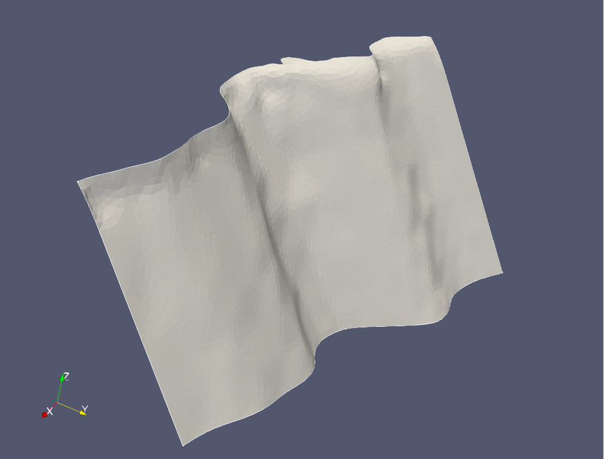

# Santa Susana Fault

This example meshes the Santa Susana fault.

Initial CFM regularized mesh at 500 m resolution:

Remeshed surface, also at 500 m resolution:

Initial surface:

Reconstructed surface:

