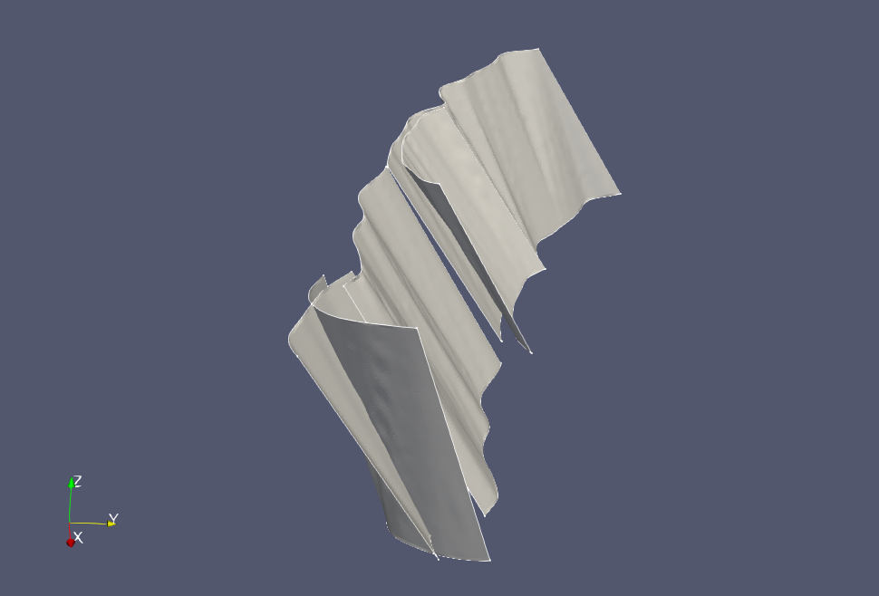
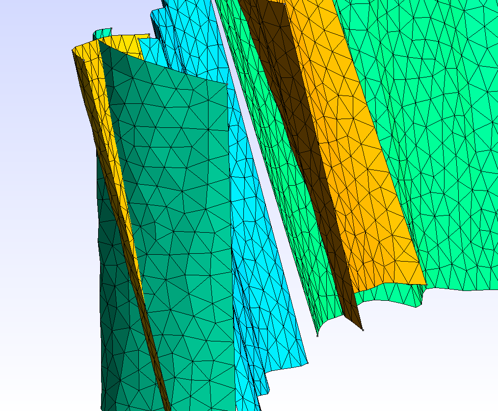
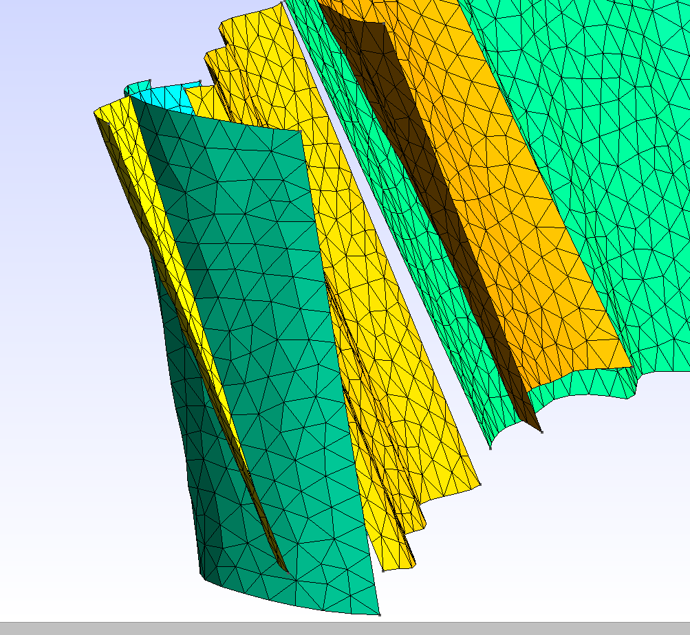
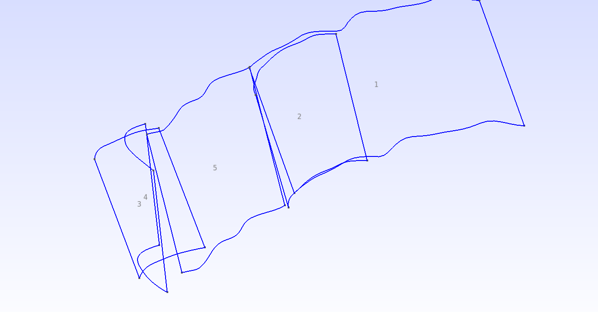

# Tutorial 3 - The Sierra Madre Fault Zone 

Welcome to part 3 in the tutorial series. This part focuses on handling
intersecting fault geometries and generating conforming meshes.


*Sierra Madre fault zone rendered in Paraview*


## Overview

The Sierra Madre fault zone contains two intersecting faults. Start by
downloading and building the geometries as usual:
```bash
$ make download build geo mesh project=nonconforming
```
We label this project `nonconforming` because the resulting mesh
`nonconforming_500m.msh` does not take the intersecting faults into consideration.



Note how the vertices of the yellow surface do not align with the vertices of
the green surface at the edge of intersection. To obtain a conforming mesh, we
use
```bash
$ make geo union=1
```
Before producing the mesh, we recommend that you first open the script
`sierra_madre.geo` in gmsh. It will take a while for gmsh to load this file
because finding the union of computational geometry surfaces can be expensive.
When gmsh has finished loading, go to `File -> Export...` and type in
`sierra_madre.brep`. Saving the file in the brep file format will allow you to
load the unified model much faster as it does not need to repeat the union
operation. However, if you reload the gmsh script file the union operation will
be recomputed at will take as long as before.

The final mesh can now be obtained by calling
```bash
$ make mesh ext=brep
```
After loading it into gmsh, it should look as follows

Note that the mesh is conforming.

## Conforming meshes
To obtain a conforming mesh, any two surfaces that intersect each other must be
split into multiple parts at their line of intersection. This operation is
a union boolean operation. When gmsh leverages the OpenCascade geometry kernel
it is capable of performing this operation and many other operations. Some
details on how to perform boolean operations using gmsh are explained in the
[gmsh reference manual](http://gmsh.info/doc/texinfo/gmsh.html). 

In this case, the Union boolean operation is computed when reading the gmsh
script generated by calling
```bash 
make geo union=1
```
All this command does is to wrap the tool `sfgeo` and passing the optional
argument `-union=1`. The resulting gmsh script contains
```bash
$ cat sierra_madre.geo
SetFactory("OpenCASCADE");
a1() = ShapeFromFile("WTRA-SMFZ-MULT-Sierra_Madre_fault_west-CFM4_m500/iges/surface_0.igs");
a2() = ShapeFromFile("WTRA-SMFZ-SWCC-Sierra_Madre_fault_low_dip-CFM4_m500/iges/surface_0.igs");
a3() = ShapeFromFile("WTRA-SMFZ-SMDE-Sierra_Madre_fault_low_dip-CFM4_m500/iges/surface_0.igs");
a4() = ShapeFromFile("WTRA-SMFZ-SMDE-Sierra_Madre_Cucamonga_connector-CFM5_m500/iges/surface_0.igs");
a5() = ShapeFromFile("WTRA-SMFZ-SMDD-Sierra_Madre_fault_low_dip-CFM4_m500/iges/surface_0.igs");
BooleanUnion { Surface{1}; Surface{2}; Surface{3}; Surface{4}; Delete; }{ Surface{5}; Delete; }
```
The only thing new here is the line at the end, calling `BooleanUnion`. The
first list of surfaces `1, 2, 3, 4` define the object, and
the and the second list surfaces define the tool. For a boolean operation, it
does not matter what surfaces are assigned as objects or tools. The `Delete`
command at the end of each list deletes the original surface. Without this
command, the original surface and the surface that has been split will both
exist in the scene. 

As we can see,
all of the five surfaces are included in the boolean operation. In some cases,
having all surfaces being part of a boolean operation can be undesirable. First,
it may result in excessive computation to check for surfaces that do not
intersect. Second, some surfaces may be sufficiently close that they are
intersecting but including this intersection results in a mesh with tiny
elements. Unfortunately, there is currently no way to instruct `sfgeo` to only
unify certain surfaces. In these particular cases, the scripting has to be taken
care of manually or using gmsh interactive capabilities. 

In this case, we also explore the how to perform the boolean operation by
determining only the surfaces that intersect each other. Remove the boolean
operation from the script and then load the script into gmsh. Since no boolean
operation is performed, the geometry should load quickly this time. What we aim
to do next is to determine the labels of the surfaces that intersect. One way to
accomplish this task is to make Surface labels visible. Go to `Tools -> Options
-> Geometry -> Visibility`. Select `Surface Labels` and set the `Label Type` to
`Elementary tags.` These settings will display a number in the center of each
surface.


From this information, you can observe that `Surface 3` and `Surface 4` are the ones
intersecting. Therefore, it is sufficient to update the script to read
```bash
$ cat sierra_madre.geo
SetFactory("OpenCASCADE");
a1() = ShapeFromFile("WTRA-SMFZ-MULT-Sierra_Madre_fault_west-CFM4_m500/iges/surface_0.igs");
a2() = ShapeFromFile("WTRA-SMFZ-SWCC-Sierra_Madre_fault_low_dip-CFM4_m500/iges/surface_0.igs");
a3() = ShapeFromFile("WTRA-SMFZ-SMDE-Sierra_Madre_fault_low_dip-CFM4_m500/iges/surface_0.igs");
a4() = ShapeFromFile("WTRA-SMFZ-SMDE-Sierra_Madre_Cucamonga_connector-CFM5_m500/iges/surface_0.igs");
a5() = ShapeFromFile("WTRA-SMFZ-SMDD-Sierra_Madre_fault_low_dip-CFM4_m500/iges/surface_0.igs");
BooleanUnion { Surface{3}; Delete; }{ Surface{4}; Delete; }
```
After updating and saving the script and reloading it, you will notice that gmsh
has taken `Surface 4` and split it into `Surface 6` and `Surface 7`. If `Surface
4` would also had intersected other surfaces, it would now be necessary to form
boolean operations using `Surface 6` and `Surface 7` as Surface `4` no longer
exists. As you can imagine, this creation of new surfaces can become quite
complicated and that is why `sfgeo` currently only unifies all surfaces at once.

